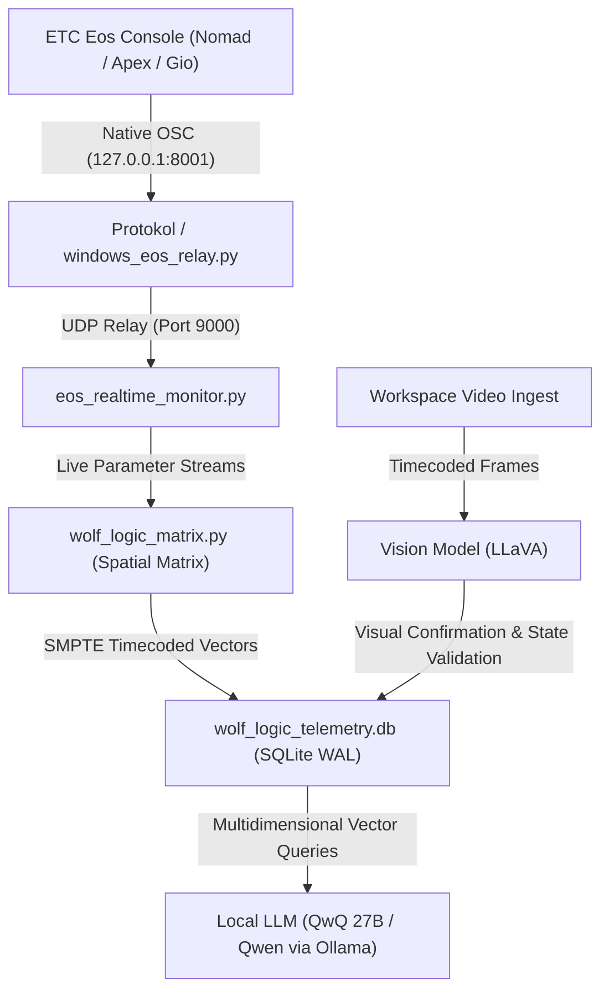

# Wolf Logic — ETC Eos Telemetry Blueprint
## 🐺 Session Handoff & Architecture Blueprint

**Date**: 2026-08-28  
**Repository**: `https://github.com/complexsimplcitymedia/ETC-Wolf-Logic.git`  
**Primary Deployment Platform**: **Apple Silicon M1 Max MacBook Pro (64GB Unified Memory, 400 GB/s Bandwidth)**  
**Target Environment**: Norwegian Cruise Line Production / Live Touring  

---

## 1. The macOS Native Advantage on M1 Max

Running natively on macOS M1 Max provides massive architectural advantages over Linux container setups:

1. **Native Native Software Ecosystem**:
   - **Hexler Protokol**: Native macOS application running out of the box.
   - **TouchOSC & TouchOSC Bridge**: Native macOS CoreMIDI virtual ports with zero-config routing.
   - **ETC Eos Nomad**: Native macOS ARM64 / Universal binary.
2. **64GB Unified Memory & 400 GB/s Bandwidth**:
   - Both the lighting matrix and the local LLMs (QwQ 27B, Qwen 4B) and Vision models (LLaVA) sit in the **same unified memory space**.
   - No CPU ➔ GPU PCI-e transfer bottlenecks.
3. **CoreAudio / CoreMIDI**:
   - Native system-level virtual MIDI cables and ultra-low-latency UDP socket polling.

---

## 2. System Architecture



---

## 3. Core Engine Components Built

### ✅ Multidimensional Spatial Matrix (`wolf_logic_matrix.py`)
- Represents fixtures across 2,560 dimensions with SMPTE timecode (`HH:MM:SS:FF`).
- High-dimensional attributes: `[Intensity, Pan, Tilt, Red, Green, Blue, White, Amber, Zoom, Iris, Gobo, Focus, Shutter]`.
- Built-in spatial math: 3D RGB Color Rotation Matrices, Pan/Tilt coordinate inversion, and rig symmetry transformations.

### ✅ Unified Telemetry Ingest Engine (`wolf_logic_db.py`)
- SQLite database (`wolf_logic_telemetry.db`) running in high-speed WAL mode.
- Tables: `console_events`, `cue_executions`, `command_history`, `channel_snapshots`, `patch_data`, `sessions`.

### ✅ Real-Time Telemetry Monitor (`eos_realtime_monitor.py`)
- Live UDP monitor daemon writing real-time console snapshots to `live_eos_state.json`.

### ✅ Protocol Converter & Diagnostic Suite
- `artnet_to_osc_bridge.py`: Art-Net DMX → ETC Eos OSC converter with delta filtering.
- `dmx_tool.py`: sACN (ANSI E1.31) and Art-Net 4 transmission and listening utility.
- `test_midi.py`: TouchOSC Bridge MIDI packet monitor.
- `test_osc.py`: Bidirectional Eos OSC diagnostic tool.
- `windows_eos_relay.py`: Local Windows host relay for isolated lighting networks.

### ✅ Cross-Platform Deployment
- **Docker**: `Dockerfile` + `docker-compose.yml` with host networking.
- **Conda**: `environment.yml` for native macOS `(wolfetc)` environment.

---

## 4. Quick Start on M1 Max MacBook Pro

```bash
# Clone the central repository
git clone https://github.com/complexsimplcitymedia/ETC-Wolf-Logic.git
cd ETC-Wolf-Logic

# Option A: Native Conda Environment
conda env create -f environment.yml
conda activate wolfetc
python .agents/skills/etc-osc-bridge/scripts/eos_realtime_monitor.py --port 9000

# Option B: Docker Stack
docker compose up -d
```

---

*🐺 Wolf Logic — Rigged once. Understood in 2,560 dimensions.*
